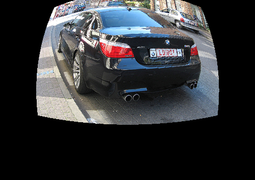
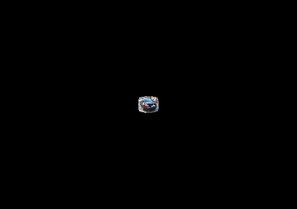
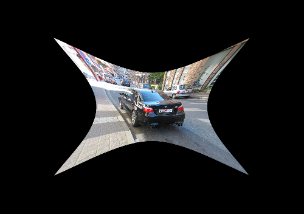

# silver-lamp

### 模块介绍
主要包含两个模块：
* virtualCam.py:用来创建一个可以实现径向畸变、哈哈镜的虚拟相机
* fisheyeCam.py：用来实现鱼眼畸变的虚拟相机

### 测试方法：
* 将图片放入images
* 调用introDistort中的test_distortion文件

***
* 原图：

* 鱼眼畸变，focal:400

* 桶形畸变 focal:100, barral_dis: 1

* 枕形畸变 focal:100 pincushion_dis:-0.07
