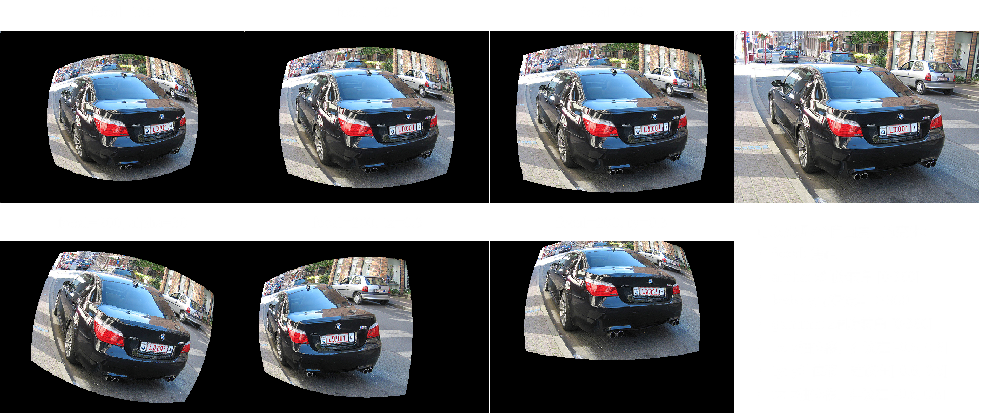
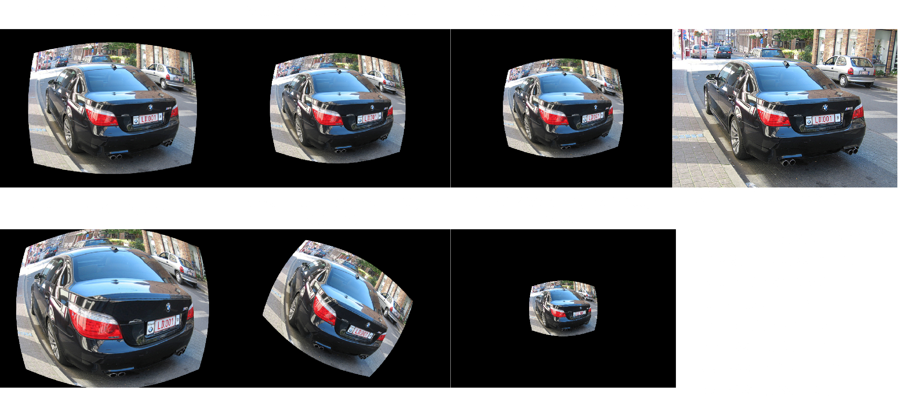

<div align="center">
    
</div>

# Distort image   

## Introduction

本项目旨在实现在**正常图形**中插入鱼眼畸变/桶形畸变/枕形畸变三种类型的畸变 
现已经可以实现在整个图形上做畸变，并且每种畸变下都有7DoV(degree of freedom)  
下一步的计划是实现在正常图形的任意位置上插入任意类型的畸变

主要包含两个模块：
* [virtualCam.py](./virtualCam.py):用来创建一个可以实现径向畸变、哈哈镜畸变的虚拟相机
* [fisheyeCam.py](./fisheyeCam.py)：用来创建一个可以实现鱼眼畸变的虚拟相机  

使用可以直接参照[introDistort.py]()文件，不必关注实现细节(可能需要一个不断调参的过程才能得到自己想要的效果)

值得声明的是，本项目的鱼眼部分的实现大部分来自：[Universal Semantic Segmentation for Fisheye Urban Driving Images](https://arxiv.org/abs/2002.03736)的官方代码  

## Requirement：
安装依赖包：
`pip install -r requirement. txt`

## Usage
* 将图片放入`images`文件夹中
* 调用[introDistort](./introDistort.py)中的`test_distortion`函数

  ```python
  # 测试images下的某一张图片
  test_distortion("000712.jpg")
  ```

​	也可以通过[introDistort](./introDistort.py)下的`fisheye_distortion, barral_distortion, pincushion_distortion`函数来实现批量处理

## Results

#### Fisheye Distortion



***

#### Barrel Distortion



***

#### Pincushion Distortion

    

***


## Further Discussion

上面的三种畸变在实现过程本质上都是在二维空间操作像素点

但是是否可以通过在三维空间中操作像平面的方式来实现畸变

#### Barrel Distortion by Warping Mesh


***

#### Pincushion Distortion by Warping Mesh


